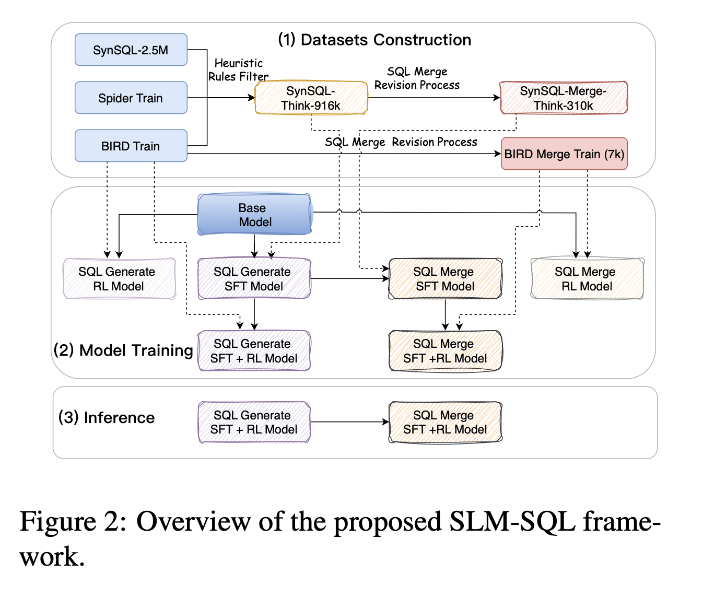
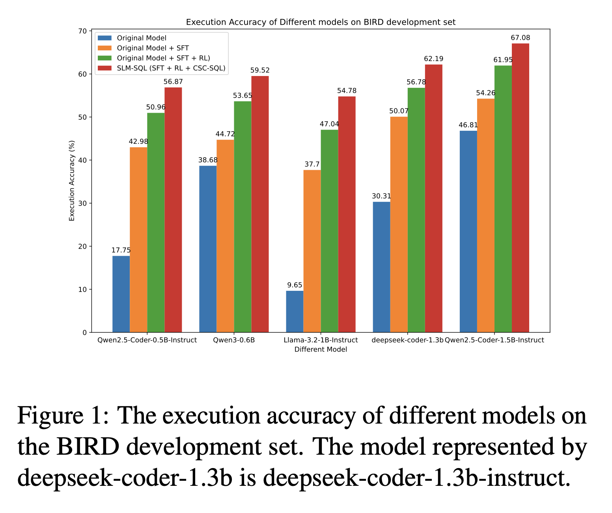
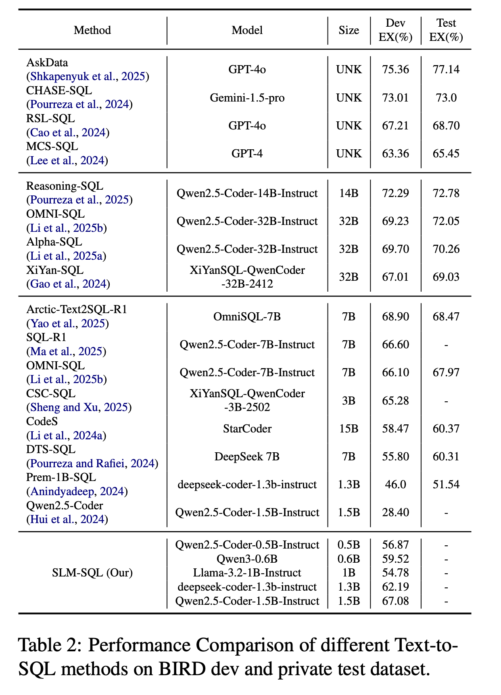
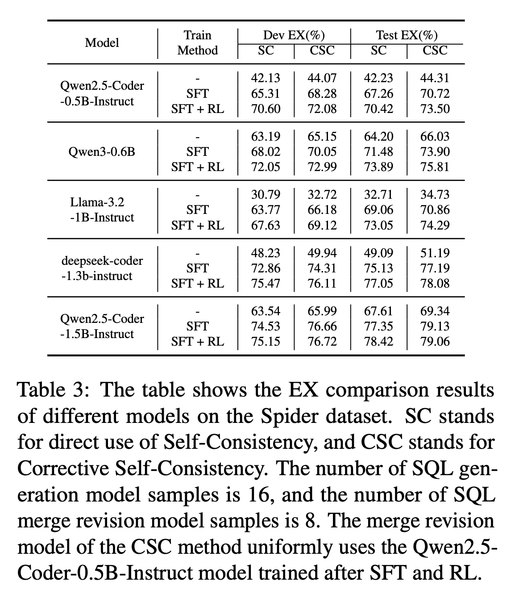
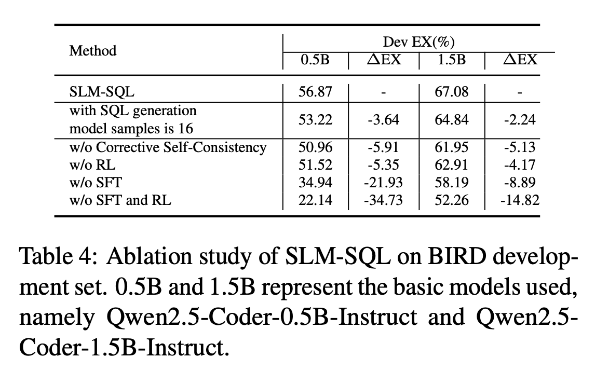

# SLM-SQL: An Exploration of Small Language Models for Text-to-SQL 

### Important Links

📖[Arxiv Paper](https://arxiv.org/abs/2505.13271) |
🤗[HuggingFace](https://huggingface.co/collections/cycloneboy/csc-sql-6835c4a52da10c54bbe14f8e) |
🤖[ModelScope](https://modelscope.cn/collections/CSC-SQL-8542177708b643) |

## News
+ `July 30, 2025`: Publish the paper to arxiv

## Introduction

> Large language models (LLMs) have demonstrated strong performance in translating natural language questions into SQL queries (Text-to-SQL). In contrast, small language models (SLMs) ranging from 0.5B to 1.5B parameters currently underperform on Text-to-SQL tasks due to their limited logical reasoning capabilities. However, SLMs offer inherent advantages in inference speed and suitability for edge deployment. To explore their potential in Text-to-SQL applications, we leverage recent advancements in post-training techniques. Specifically, we used the open-source SynSQL-2.5M dataset to construct two derived datasets: SynSQL-Think-916K for SQL generation and SynSQL-Merge-Think-310K for SQL merge revision. We then applied supervised fine-tuning and reinforcement learning-based post-training to the SLM, followed by inference using a corrective self-consistency approach. Experimental results validate the effectiveness and generalizability of our method, SLM-SQL. On the BIRD development set, the five evaluated models achieved an average improvement of 31.4 points. Notably, the 0.5B model reached 56.87\% execution accuracy (EX), while the 1.5B model achieved 67.08\% EX. We will release our dataset, model, and code to github: https://github.com/CycloneBoy/slm_sql.

### Framework 





### Main Results









Performance Comparison of different Text-to-SQL methods on BIRD dev and test dataset.




## Model

| **Model and Dataset**                 | Modelscope                                                                                      | HuggingFace                                                                                |
|---------------------------------------|-------------------------------------------------------------------------------------------------|--------------------------------------------------------------------------------------------|
| bird train and dev dataset            | [🤖 Modelscope](https://modelscope.cn/datasets/cycloneboy/bird_train)                           | [🤗 HuggingFace](https://huggingface.co/datasets/cycloneboy/bird_train) |

## Dataset

| **Model and Dataset**                 | Modelscope                                                                                      | HuggingFace                                                                                |
|---------------------------------------|-------------------------------------------------------------------------------------------------|--------------------------------------------------------------------------------------------|
| bird train and dev dataset            | [🤖 Modelscope](https://modelscope.cn/datasets/cycloneboy/bird_train)                           | [🤗 HuggingFace](https://huggingface.co/datasets/cycloneboy/bird_train) |


## TODO

- [ ] Release inference code
- [ ] Upload Model
- [ ] Release training code
- [ ] Fix bug
- [ ] Update doc

## Thanks to the following projects
- [csc_sql](https://github.com/CycloneBoy/csc_sql)
- [open-r1](https://github.com/huggingface/open-r1)
- [OmniSQL](https://github.com/RUCKBReasoning/OmniSQL)

## Citation

```bibtex

@misc{sheng2025cscsqlcorrectiveselfconsistencytexttosql,
      title={SLM-SQL: An Exploration of Small Language Models for Text-to-SQL }, 
      author={Lei Sheng and Shuai-Shuai Xu},
      year={2025},
      eprint={xxx},
      archivePrefix={arXiv},
      primaryClass={cs.CL},
      url={https://arxiv.org/abs/xxx}, 
}

@misc{sheng2025cscsqlcorrectiveselfconsistencytexttosql,
      title={CSC-SQL: Corrective Self-Consistency in Text-to-SQL via Reinforcement Learning}, 
      author={Lei Sheng and Shuai-Shuai Xu},
      year={2025},
      eprint={2505.13271},
      archivePrefix={arXiv},
      primaryClass={cs.CL},
      url={https://arxiv.org/abs/2505.13271}, 
}
```